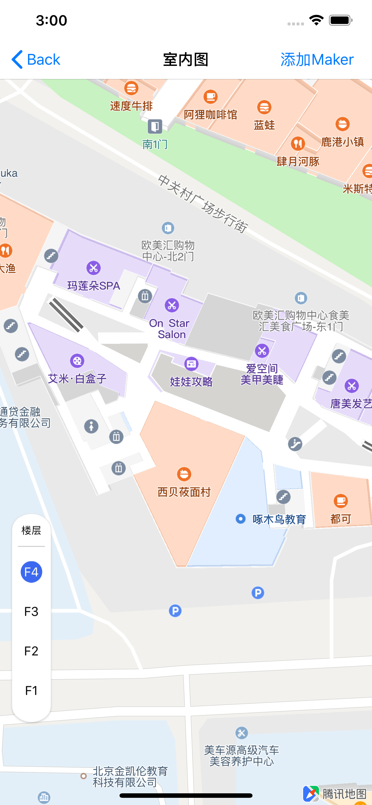
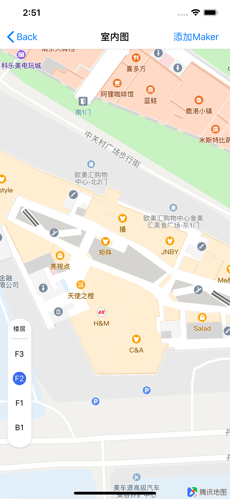
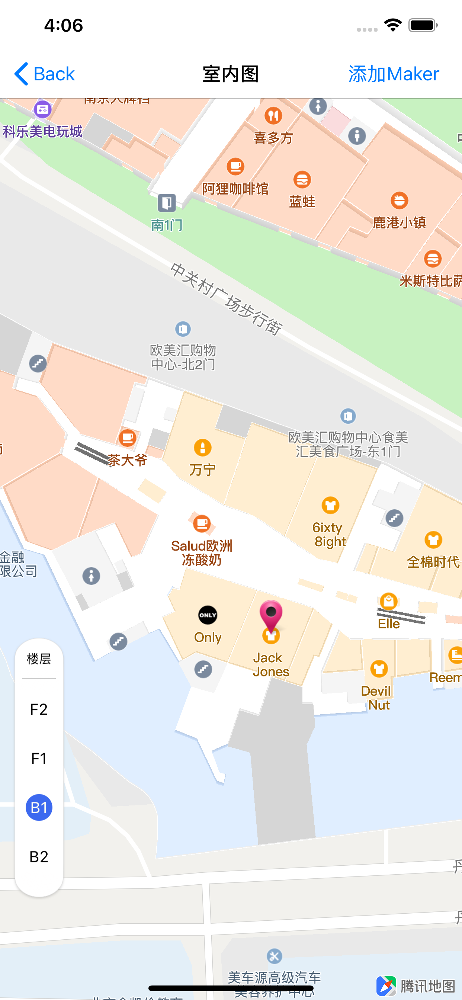
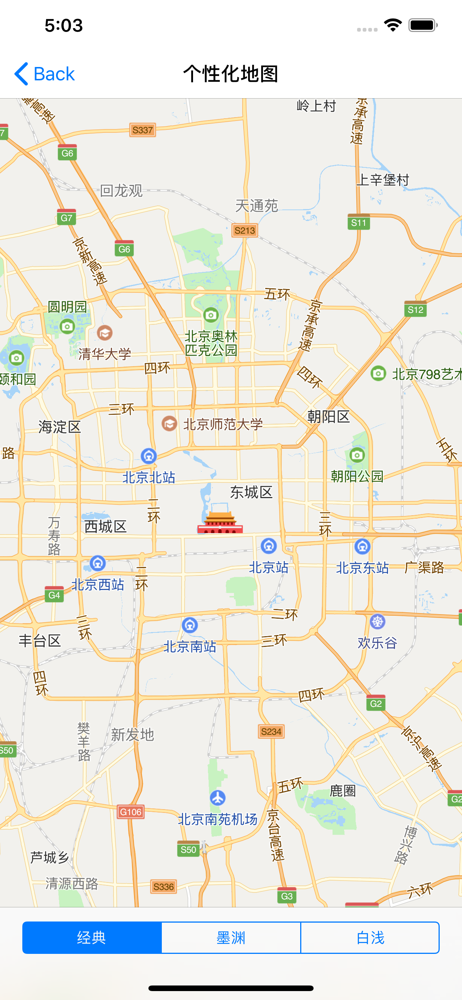
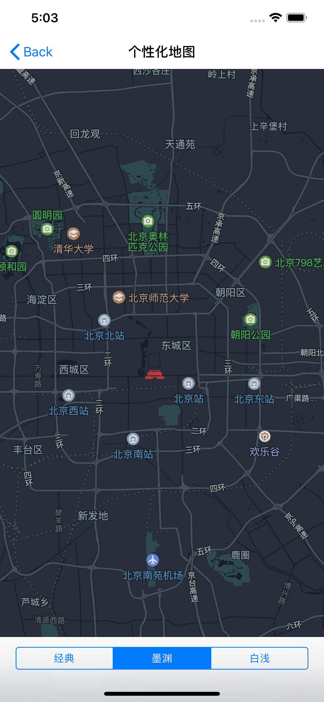
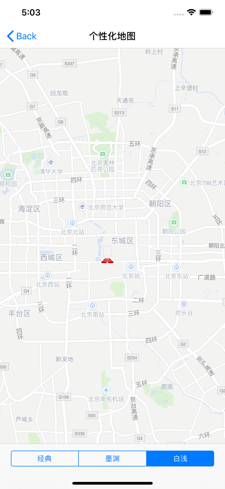
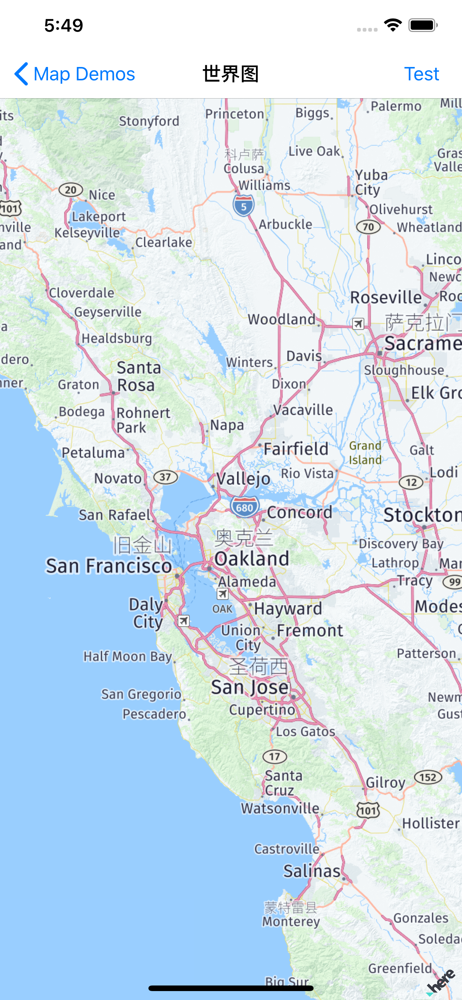

# 地图显示


## 显示基础地图


在显示地图之前，请您保证已正确的配置SDK和为地图SDK设置了正确的Key。具体步骤请参考[接入指南](intro.md)


通常使用2种方法显示地图：StoryBoard和代码动态添加。


#### 通过StoryBoard显示地图

1. 根据接入指南，在Build Phases中添加链接QMapKit.framework并在Other Linker Flags中添加-ObjC

2. 在Storyboard的ViewController中为地图添加UIView，并将其Custom Class指定为QMapView

   

3. 运行工程即可。

#### 通过代码动态显示地图

首先您需要创建一个QMapView的视图实例(View)，然后您只需要将它添加到View系统上即可显示地图内容。

在ViewController.h文件中添加QMapView

```
#import <UIKit/UIKit.h>
#import <QMapKit/QMapKit.h>
 
@interface ViewController : UIViewController <QMapViewDelegate>
@property (nonatomic, strong) QMapView *mapView;
@end
```

在ViewController.m文件添加实例化QMapView的代码

```
- (void)viewDidLoad
{
    [super viewDidLoad];
    // Do any additional setup after loading the view, typically from a nib.
    //初始化地图实例
  	self.mapView = [[QMapView alloc] initWithFrame:self.view.bounds];
  	//把mapView添加到view中进行显示
    [self.view addSubview:self.mapView];
}
```

运行工程，地图显示效果如下

[](https://camo.githubusercontent.com/d2e75cd7693bcf5e5c8c3c2d81ca581bde614fca/68747470733a2f2f75706c6f61642e63632f69312f323031392f30342f30382f7374416b6a4b2e706e67)

## 


## 设置地图类型

腾讯地图SDK（IOS）提供2中类型的基本地图，标准地图和卫星地图。

具体如下：

| 名称     | 说明              |
| :------- | :---------------- |
| 标准地图 | QMapTypeStandard  |
| 卫星地图 | QMapTypeSatellite |

同时，地图还支持路况图层，用于实时展示道路的交通状况。标准地图和卫星地图均可显示路况信息。

##### 1、标准地图与实时路况：

标准地图的信息包括区域信息，路网信息、建筑物及重要的POI（兴趣点--地图上的图标及文字）；

设置显示标准地图的示例代码如下：

```
//显示标准地图
[self.mapView setMapType:QMapTypeStandard]; 
```

##### 2、卫星图：

卫星地图设置：

设置显示卫星地图的示例代码如下：

```
//显示卫星地图
[self.mapView setMapType:QMapTypeSatellite];
```

##### 3、实时路况：

腾讯地图还提供了实时路况图层，可以为提供实时交通数据的城市展示实时交通状况。

实时路况的示例代码如下：

```
//开启实时路况
self.mapView.showsTraffic = YES; 
//关闭实时路况
self.mapView.showsTraffic = NO; 
```


带实时路况的标准地图和卫星图的效分别果如下所示：

[](https://camo.githubusercontent.com/fe70793144f787972ac86b8edf72090ba4806809/68747470733a2f2f75706c6f61642e63632f69312f323031392f30342f30382f64444e724a672e706e67)


## 室内地图

### 1.使用说明
**室内图功能为付费功能**，已申请APIKey的开发者请确认是否已有室内图权限，如没有，开发者则需将开发者账户升级为[企业级](https://lbs.qq.com/console/enterprise-info.html)，开通成功后[联系腾讯位置服务](https://lbs.qq.com/contractus.html)进行服务开通。
把已申请室内图权限的key在AppDelegate.m文件里填入：
```objective-c
// Configure API Key.
[QMapServices sharedServices].APIKey = @"有室内图权限的key";
```
### 2.室内图功能开关
| 功能                        | 实现接口                                              |
| --------------------------- | ----------------------------------------------------- |
| 开启/关闭室内图 (默认为NO)  | - (void)setIndoorEnabled:(BOOL)indoorEnabled; |
| 内置楼层选择控件，默认为YES | BOOL indoorPicker                                 |
当开启室内图功能后，对应建筑的室内图会在一定缩放级别开始显示（显示的缩放级别与室内图的大小有关）。如下图，为北京欧美汇的室内图：
```objective-c
// 显示室内图
[self.mapView setIndoorEnabled:YES];
// 显示室内图楼层控件
[self.mapView setIndoorPicker:YES];
```


用户也可以设置不显示默认楼层控件

```objective-c
[self.mapView setIndoorPicker:NO];
```


### 3.获取室内建筑物数据


室内建筑数据对应的类是QIndoorBuilding，可通过QMapView的activeBuilding获取（当前无室内图激活时为nil）。类的数据成员如下表：


| 属性                 | 实现接口                        |
| -------------------- | ------------------------------- |
| 建筑物唯一标识       | NSString *guid                  |
| 默认加载的楼层索引   | NSUInteger defaultLevelIndex    |
| 本建筑的所有楼层数据 | NSArray<QIndoorLevel *> *levels |
| 建筑物名称           | NSString *name                  |
| 建筑物的外接矩形     | QMapRect boundingMapRect        |


获取当前激活建筑物的数据和楼层的接口如下：

```objective-c
// 通过QMapView获取当前激活的室内建筑物和当前楼层

/**
 * @brief  当前处于激活态的整个室内图数据
 */
@property(nonatomic, strong, readonly) QIndoorBuilding *activeBuilding;

/**
 * @brief  当前正在展示的室内楼层.
 */
@property(nonatomic, strong) QIndoorLevel *activeLevel;


//获取当前室内图的建筑及楼层名字
NSLog(@"Current active building is %@", self.mapView.activeBuilding.name);
NSLog(@"Current active level is %@", self.mapView.activeLevel.name);
```


| 说明                                                         | 实现接口                        |
| ------------------------------------------------------------ | ------------------------------- |
| 当前处于激活态的整个室内图数据（当前屏幕内有可能有多个室内图，但仅会有一栋处于屏幕中心区域的建筑物处于“激活”态） | QIndoorBuilding *activeBuilding |


### 4.切换室内图的楼层


QIndoorInfo包含室内图标识楼号和楼层


| 属性                   | 实现接口                                                     |
| ---------------------- | ------------------------------------------------------------ |
| 室内图唯一标识楼号     | NSString *buildUid                                           |
| 室内图楼层             | NSString *levelName                                          |
| 初始化室内图数据类     | - (instancetype)initWithBuildUid:(NSString *)buildUid levelName:(NSString *)levelName; |
| 改变指定建筑物默认楼层 | - (void)setActiveIndoorInfo:(QIndoorInfo *)indoorInfo;       |


生成所需的QIndoorInfo类，改变对应建筑物默认楼层的实现如下：


```objective-c
QIndoorInfo *indoorInfo = [[QIndoorInfo alloc] initWithBuildUid:@"********" levelName:@"B1"];
//"********"需要更换为对应建筑物的buildUid
//改变对应建筑物默认楼层
[self.mapView setActiveIndoorInfo:indoorInfo];
```
如下图显示，欧美汇室内图从F4切换到F2：




### 5.室内图变化回调

在室内建筑物激活或切换时，也会收到室内变化或楼层变化的回调：

| 功能                                                  | 实现接口                                                     |
| ----------------------------------------------------- | ------------------------------------------------------------ |
| 获取更新后的室内建筑信息（切换室内图 后会调用此函数） | - (void)mapView:(QMapView *)mapView didChangeActiveBuilding:(QIndoorBuilding *)building; |
| 获取更新后楼层信息 （切换楼层后会调用此函数）         | - (void)mapView:(QMapView *)mapView didChangeActiveLevel:(QIndoorLevel *)level; |
示例如下：
```objective-c
//切换室内图回调
- (void)mapView:(QMapView *)mapView didChangeActiveBuilding:(QIndoorBuilding *)building {
    NSLog(@"Current active building ID is %@", building.guid);
    NSLog(@"Current active building name is %@", building.name);
}

//切换楼层回调
- (void)mapView:(QMapView *)mapView didChangeActiveLevel:(QIndoorLevel *)level {
    NSLog(@"Active level is %@", level.name);
}
```
### 6.室内POI点击
点击室内图上文字图标的数据信息 （QIndoorPoiInfo类）


| 属性               | 实现接口               |
| ------------------ | ---------------------- |
| 所在室内图楼层     | NSString *levelName    |
| 所在室内图唯一标识 | NSString *buildingGUID |
| 所在室内图楼的名称 | NSString *buildingName |


POI点击回调

| 功能                                                         | 实现接口                                                     |
| ------------------------------------------------------------ | ------------------------------------------------------------ |
| 获取室内POI信息 （点击地图poi图标处会调用此接口，需要把poi转换为QIndoorPoiInfo类） | - (void)mapView:(QMapView *)mapView didTapPoi:(QPoiInfo *)poi; |


回调示例如下：

```objective-c
//点击POI回调
- (void)mapView:(QMapView *)mapView didTapPoi:(QPoiInfo *)poi
{
    if ([poi isKindOfClass:[QIndoorPoiInfo class]]) {
        QIndoorPoiInfo *poiInfo = (QIndoorPoiInfo *)poi;
        NSLog(@"POI building ID %@",poiInfo.buildingGUID);
        NSLog(@"POI building Name %@",poiInfo.buildingName);
        NSLog(@"POI building level %@",poiInfo.levelName);
    }
}
```
### 7.带室内属性的地图覆盖物
腾讯地图提供了带室内楼层属性的元素，目前包括 marker、polyline。在增加室内属性以后，该marker或polyline仅在该建筑物的该楼层展示。

以 marker 为例说明设置室内属性的方法和展示效果：

```objective-c
- (void)handleTestAction
{
		// ******需要替换为对应建筑物的BuildUid
		QIndoorInfo *indoorInfo = [[QIndoorInfo alloc] initWithBuildUid:@"******" levelName:@"B1"];
 		self.annotation = [[QPointAnnotation alloc] init];
 		self.annotation.coordinate = CLLocationCoordinate2DMake(39.865105,116.378345);
 		// 设置室内数据到indoor属性，标明它为室内的覆盖物
 		self.annotation.indoorInfo = indoorInfo;
 		[self.mapView addAnnotation:self.annotation];
}

//marker的render
- (QAnnotationView *)mapView:(QMapView *)mapView viewForAnnotation:(id<QAnnotation>)annotation
{
    if ([annotation isKindOfClass:[QPointAnnotation class]]) {
        static NSString *pointReuseIndetifier = @"pointReuseIndetifier";
        QAnnotationView *render = [[QAnnotationView alloc] initWithAnnotation:annotation reuseIdentifier:pointReuseIndetifier];
        if (render == nil)
        {
            render = [[QAnnotationView alloc] initWithAnnotation:annotation reuseIdentifier:pointReuseIndetifier];
        }
        render.canShowCallout   = YES;
        UIImage *img = [UIImage imageNamed:@"marker"];
        render.image = img;
        render.centerOffset = CGPointMake(0, -img.size.height / 2.0);
        return render;
    }
    return nil;
}
```
如图所示，添加的 marker 只在欧美汇的 B1 层展示，在其他层不展示


### 8.自定义楼层控件
开发者可以通过室内图状态的回调信息定制自己的楼层控件，包括UI样式和位置都可以灵活定义。定制前，先隐藏默认的楼层控件：
```objective-c
// 显示室内图
[self.mapView setIndoorEnabled:YES];
// 不显示室内图楼层控件
[self.mapView setIndoorPicker:NO];
```
然后通过室内图变化回调中获取的信息，来实现建筑物的状态展示，和楼层信息的实时切换
```objective-c
- (void)mapView:(QMapView *)mapView didChangeActiveBuilding:(QIndoorBuilding *)building {    
    //根据建筑物信息显示楼层控件
  	if (buiding == nil)
    {
      	// myPicker.hidden = YES;
    }
  	else
    {
      	// myPicker.hidden = NO;
    }
}
- (void)mapView:(QMapView *)mapView didChangeActiveLevel:(QIndoorLevel *)level {
    //根据建筑物信息更新楼层控件
  	int NSUInteger index = [self findIndex:level];  // 查询索引
    if (index < mapView.activeBuilding.levels.count) 
    {
        self.picker.selectIndex = index;
    }
}

- (void)handleSelectLevel:(MyPicker *)picker {
    //用户点击楼层控件时更换楼层
  	int selectedIndex = picker.selectIndex;  // b1的索引
    if ([mapView.activeBuilding.guid isEqualToString:@"xxxxxxxx"]) {
        mapView.activeLevel = mapView.activeBuilding.levels[selectedIndex];
    }
}
```


## 个性化地图

腾讯 iOS 3D 地图 SDK自 v4.1.1起，支持使用个性化地图模版，通过选择不同的模版可实现底图配色风格的切换。

前往选择[个性化地图模版](https://lbs.qq.com/console/customized/set/)，设定好模板后可根据地图模板ID切换个性化地图。

示例代码：

```
[self.mapView setMapStyle: (int)];	//个性化地图的ID从 1 开始，具体数量依据个人配置为准
```

假如用户在个性化配置平台中的样式按次序依次是：经典，墨渊，白浅，玉露。

如图：


而通过接口调用时设置样式如下：

```
//个性化地图的ID从 1 开始，具体数量依据个人配置为准
// case1: 设置为1（在配置列表中，第1个是经典）
[self.mapView setMapStyle: 1];
// case2: 设置为2（在配置列表中，第2个是墨渊）
[self.mapView setMapStyle: 2];
// case3: 设置为3（在配置列表中，第3个是白浅）
[self.mapView setMapStyle: 3];
```

则最终显示的效果中，样式依次分别为经典，白浅。




## 显示建筑物


腾讯 iOS 3D 地图 SDK支持建筑物是否显示的开关配置，也支持是否显示3D立体效果的配置。当显示3D建筑物时，地图有一定的倒伏角效果会更好。

接口介绍：

| 功能                         | 实现接口                                     |
| ---------------------------- | -------------------------------------------- |
| 开启/关闭建筑物 (默认为YES)  | @property (nonatomic) BOOL showsBuildings;   |
| 显示/关闭3D效果（默认为YES） | @property (nonatomic) BOOL shows3DBuildings; |

示例代码：

~~~objc
// 显示建筑物
self.mapView.showsBuildings = YES;
// 显示建筑物的3D效果
self.mapView.shows3DBuildings = YES;
~~~

效果图：(左边为3D效果，右边为非3D效果)


## 海外图展示


腾讯 iOS 3D 地图 SDK也支持海外地图的展示，用于满足海外的位置需求。

显示海外图，您需要先开通海外图的权限。请前往腾讯位置服务官网[海外地图权限申请](https://lbs.qq.com/product/abroad.html)，点击**开始体验**申请权限。


在开通海外图后，海外区域的地图将自动展示海外地图。例如旧金山时，地图效果如下：




