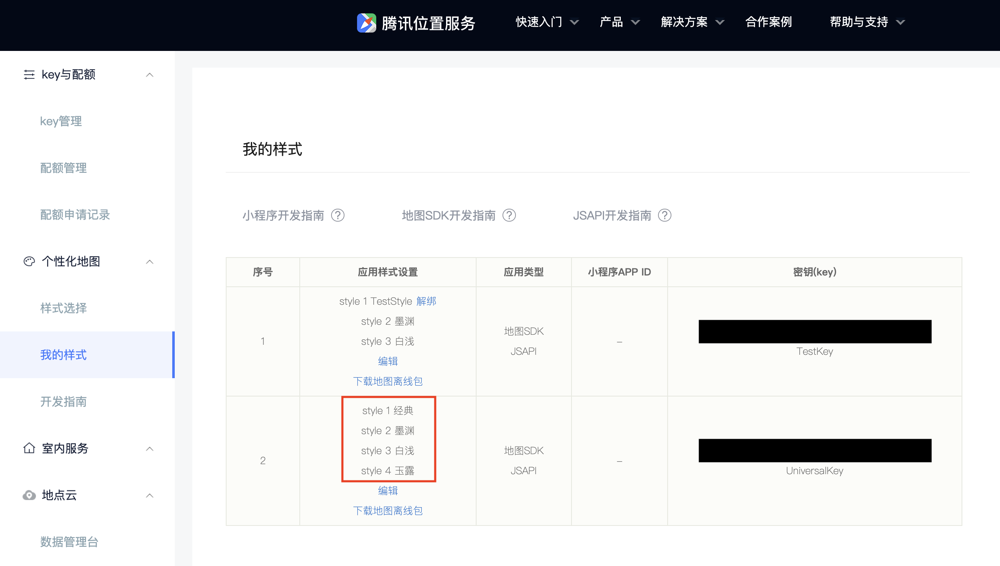

## 个性化地图

腾讯 iOS 3D 地图 SDK自 v4.1.1起，支持使用个性化地图模版，通过选择不同的模版可实现底图配色风格的切换。

前往选择[个性化地图模版](https://lbs.qq.com/console/customized/set/)，设定好模板后可根据地图模板ID切换个性化地图。

示例代码：

```objC
[self.mapView setMapStyle: (int)];	//个性化地图的ID从 1 开始，具体数量依据个人配置为准
```

假如用户在个性化配置平台中的样式按次序依次是：经典，墨渊，白浅，玉露。

如图：



通过接口调用时设置样式如下：

```objC
//个性化地图的ID从 1 开始，具体数量依据个人配置为准
// case1: 设置为1（在配置列表中，第1个是经典）
[self.mapView setMapStyle: 1];
// case2: 设置为2（在配置列表中，第2个是墨渊）
[self.mapView setMapStyle: 2];
// case3: 设置为3（在配置列表中，第3个是白浅）
[self.mapView setMapStyle: 3];
```

则最终显示的效果中，样式依次分别为经典，白浅。


