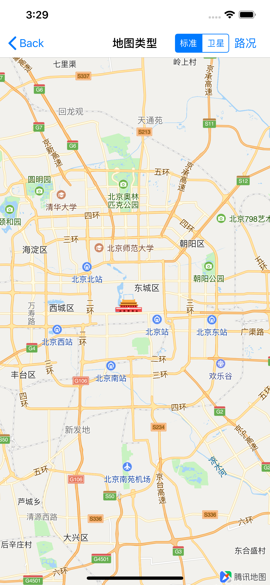
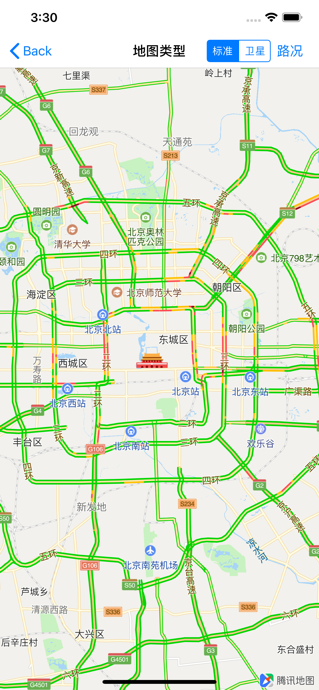

## 设置地图类型

腾讯地图SDK（iOS）提供几种预置基本的地图图层：标准地图，卫星地图，和路况图层。


**地图类型**

标准地图，卫星地图属于2种基本的地图类型。开发者可以通过接口在这2种类型间切换。

| 名称                 | 说明              |
| :------------------- | :---------------- |
| 标准地图（默认类型） | QMapTypeStandard  |
| 卫星地图             | QMapTypeSatellite |

接口：

```objC
/*@
 *  @brief  地图类型
 */
@property (nonatomic, assign) QMapType mapType;
```


**路况图层**

地图还支持路况图层，用于实时展示道路的交通状况。标准地图和卫星地图均可显示路况信息。


### 1. 标准地图

标准地图的信息包括精细的面区域信息，道路信息、建筑物及重要的POI（兴趣点--地图上的图标及文字）；

设置显示标准地图的示例代码如下：

```objC
// 显示标准地图（默认也是标准地图）
[self.mapView setMapType:QMapTypeStandard]; 
```

效果如下：

[

### 2. 卫星图

卫星地图设置：

设置显示卫星地图的示例代码如下：

```objC
// 显示卫星地图
[self.mapView setMapType:QMapTypeSatellite];
```

效果如下：

[ 

### 3. 实时路况

腾讯地图还提供了实时路况图层，可以为提供实时交通数据的城市展示实时交通状况。

实时路况的示例代码如下：

```objC
// 开启实时路况
self.mapView.showsTraffic = YES; 
// 关闭实时路况
self.mapView.showsTraffic = NO; 
```


带实时路况的标准地图和卫星图的效分别果如下所示：

[


