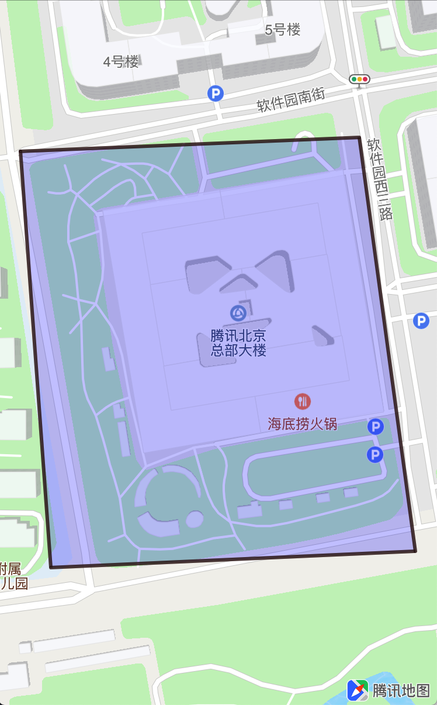

## 限制显示区域

地图SDK可以设置地图只能在指定的区域范围内移动，如果希望设置仅显示在一块矩形区域，可使用此功能。

使用方法如下：

```objC
// 矩形四角坐标
CLLocationCoordinate2D coordinates[4];
coordinates[0] = CLLocationCoordinate2DMake(40.041554,116.271508);
coordinates[1] = CLLocationCoordinate2DMake(40.041652,116.274619);
coordinates[2] = CLLocationCoordinate2DMake(40.03863,116.271787);
coordinates[3] = CLLocationCoordinate2DMake(40.038745,116.275134);

// 计算最小外接区域
QCoordinateRegion region = QBoundingCoordinateRegionWithCoordinates(coordinates, 4);
    
// 将region转为maprect
QMapRect maprect = QMapRectForCoordinateRegion(region);

/**
 * @brief 根据边界留宽显示限制地图区域范围(2D北朝上场景时)
 * @param mapRect 待调整的地理范围
 * @param mode    限制地区区域的对齐方式，分等宽对齐和等高对齐
 */
[self.mapView setLimitMapRect:maprect mode:QMapLimitRectFitWidth];
```

限制区域显示的限制方式 QMapLimitRectFitMode，分别以区域宽度为参考值和以区域高度为参考值：

| 限制模式 | 说明
| --- | ---
| QMapLimitRectFitWidth | 此模式会以 mapRect宽度为参考值限制地图的控制区域，保证横向区域完全展示
| QMapLimitRectFitHeight | 此模式会以 mapRect高度为参考值限制地图的控制区域，保证纵向区域完全展示

当传入的mapRect的值都为0时，即可取消区域限制，示例如下：

```objC
[self.mapView setLimitMapRect:QMapRectMake(0, 0, 0, 0) mode:QMapLimitRectFitWidth];
```

### 常见用法
<hr>
1. 将地图的显示范围固定在一个区域，通过拖动地图也无法离开这个区域，如将区域固定在腾讯北京总部大楼：

	```objC
	[self.mapView setLimitMapRect:rectangle.boundingMapRect mode:QMapLimitRectFitWidth];
	```

	