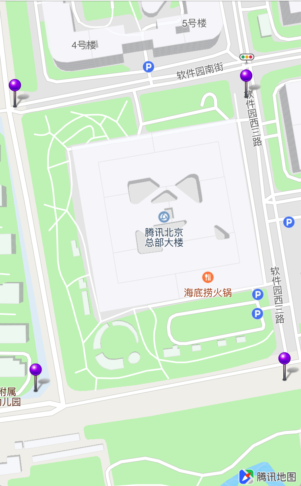

## 视野范围设置

视野范围设置分为：

1. 设置地图当前可见范围(mapRect)
2. 设置地图当前可视区域(region)

<br>

### 设置地图可见范围
<hr>
QMapView类中的的`setVisibleMapRect:`方法用于设置地图显示范围，并使mapRect四周保留insets指定的边界区域，示例如下：

```objC
/**
 *  @brief 设置当前地图可见范围的mapRect，并保留insets指定的边界区域
 *
 *  @param mapRect  目标mapRect
 *  @param insets   要嵌入的边界
 *  @param animated 是否采用动画
 */
[self.mapView setVisibleMapRect:QMapRectMake(220911420, 101575260, 24000, 38592)
                    edgePadding:UIEdgeInsetsMake(10, 10, 10, 10)
                       animated:YES];
```

<br>

### 设置地图可见区域
<hr>
region表示地图中的一块区域，通常用于将地图当前视野调整到指定的区域范围显示，示例如下：

```objC
// 创建region
QCoordinateRegion region = QCoordinateRegionMake(CLLocationCoordinate2DMake(39.927642, 116.559448), QCoordinateSpanMake(1, 1));

/**
 *  @brief 设定当前地图的region
 *
 *  @param region   要设定的地图范围，用经纬度的方式表示
 *  @param insets   要嵌入的边界
 *  @param animated 是否采用动画
 */
[self.mapView setRegion:region
            edgePadding:UIEdgeInsetsMake(10, 10, 10, 10)
               animated:YES];
```

<br>

### 常用方法
<hr>

1. 展示Annotation、Polyline和多边形：
	1. 获取构成Annotation、Polyline和多边形的的坐标
	2. 计算这些坐标构成的最小外接region
	3. 更新地图显示region

		```objC
		// 点标注坐标
		CLLocationCoordinate2D coordinates[4];
		coordinates[0] = CLLocationCoordinate2DMake(40.041554,116.271508);
		coordinates[1] = CLLocationCoordinate2DMake(40.041652,116.274619);
		coordinates[2] = CLLocationCoordinate2DMake(40.03863,116.271787);
		coordinates[3] = CLLocationCoordinate2DMake(40.038745,116.275134);
		    
		// 计算最小外接区域
		QCoordinateRegion region = QBoundingCoordinateRegionWithCoordinates(coordinates, 4);
		// 更新可见region
		[self.mapView setRegion:region edgePadding:UIEdgeInsetsZero animated:YES];
		```
	4. 效果如图所示：
	
		
		

2. 展示Circle
	1. 圆形的数据模型QCircle，包含了构成圆形的中心点和半径，`circle.boundingMapRect`属性表示该圆形的外接矩形
	2. 更新地图显示mapRect

		```objC
		// 获取外接矩形
		QMapRect maprect = _circle.boundingMapRect;
		// 更新显示mapRect
		[self.mapView setVisibleMapRect:maprect edgePadding:UIEdgeInsetsMake(20, 20, 20, 20) animated:YES];
		```
	3. 效果如图所示：

		
<br>

### 常见问题
<hr>
1. `setVisibleMapRect:edgePadding:animated:`方法中的`edgePadding`参数的作用

	> `edgePadding`参数接收`UIEdgeInsets`类型的值，显示指定的mapRect范围时，可以在四周加入边界。如展示Circle案例中，左右各预留20的边界，这样可以让Circle显示在更靠中间的位置

2. 调用`setVisibleMapRect:edgePadding:animated:`方法没有效果，或者出现了地图移动到指定的范围之外

	> 设置`edgePadding`参数时，如果`UIEdgeInsets`的left-right和top-bottom值的和不能超过屏幕的宽高。
