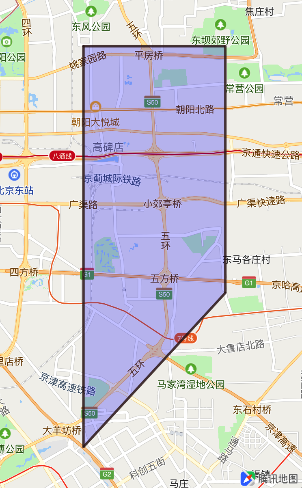

##绘制面

面图形，是由地图上一组线段组成的封闭图形，包括多边形和圆，用户可以描边、填充颜色等属性。

绘制面的基本绘制需要两个类，数据类(QPolygon、QCircle)提供绘制视图所需的数据，图形视图(QPolygonView、QCircleView)则使用数据来绘制图形。

<br>

###多边形
<hr>
####创建多边形
在地图中使用QPolygon和QPolygonView绘制多边形的基本步骤如下：

1. 创建数据类QPolygon：

	```objC
	CLLocationCoordinate2D coordinates[4];
	coordinates[0].latitude = 39.9442;
	coordinates[0].longitude = 116.514;
	    
	coordinates[1].latitude = 39.9442;
	coordinates[1].longitude = 116.574;
	    
	coordinates[2].latitude = 39.8642;
	coordinates[2].longitude = 116.574;
	    
	coordinates[3].latitude = 39.8142;
	coordinates[3].longitude = 116.514;
	
	QPolygon *polygon = [QPolygon polygonWithCoordinates:coordinates count:4];
	
	[self.mapView addOverlay:polygon];
	```
2. 实现&lt;QMapViewDelegate&gt;的`mapView: viewForOverlay:`方法，创建QPolygonView：

	```objC
	- (QOverlayView *)mapView:(QMapView *)mapView viewForOverlay:(id<QOverlay>)overlay
	{
	if ([overlay isKindOfClass:[QPolygon class]])
	    {
	        QPolygonView *polygonRender = [[QPolygonView alloc] initWithPolygon:overlay];
	        // 设置线宽
	        polygonRender.lineWidth   = 3;
	        // 设置描边颜色
	        polygonRender.strokeColor = [UIColor colorWithRed:.2 green:.1 blue:.1 alpha:.8];
	        // 设置填充颜色
	        polygonRender.fillColor   = [[UIColor blueColor] colorWithAlphaComponent:0.2];
	        
	        return polygonRender;
	    }
	    
	    return nil;
	}
	```

3. 效果如图所示：

	

<br>

###圆形
<hr>
在地图中使用QCircle和QCircleView绘制多边形的基本步骤如下：

1. 创建QCircle只需要提供圆心坐标以及圆半径(米)即可，示例如下：

	```objC
	QCircle *circle = [QCircle circleWithCenterCoordinate:CLLocationCoordinate2DMake(39.8842, 116.264) radius:4000];
	[self.mapView addOverlay:circle];
	```
2. 实现&lt;QMapViewDelegate&gt;的`mapView: viewForOverlay:`方法，创建QCircleView：

	```objC
	- (QOverlayView *)mapView:(QMapView *)mapView viewForOverlay:(id<QOverlay>)overlay
	{
	    if ([overlay isKindOfClass:[QCircle class]])
	    {
	        QCircleView *circleView = [[QCircleView alloc] initWithCircle:overlay];
	        circleView.lineWidth   = 3;
	        circleView.strokeColor = [UIColor colorWithRed:.2 green:.1 blue:.1 alpha:.8];
	        circleView.fillColor   = [[UIColor blueColor] colorWithAlphaComponent:0.2];
	        
	        return circleView;
	    }
	    
	    return nil;
	}
	```
3. 效果如图所示：

	
	
<br>

###常见问题
<hr>
1. 为什么多边形的连线是中间交叉的？

	> 在创建QPolygon数据模型时，需要注意传入的坐标要按照顶点连接顺序传入，保证图形闭合时顶点连线不会交叉。