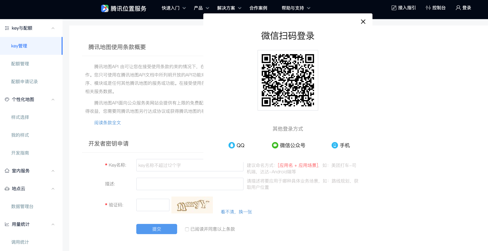

## 这是一个导语


# 介绍

腾讯地图SDK (iOS) 是一套基于 iOS 8.0及以上版本的地理位置服务应用程序开发接口。 通过调用腾讯地图SDK接口，您可以轻松访问腾讯地图服务和数据，构建功能丰富、交互性强、契合各种行业场景的地图类应用程序。您也可以在自己的iOS应用中加入地图相关的功能，包括：地图展示、标注、绘制图形等。

使用本平台地图SDK之前，在技术层面您需具备一定的iOS开发经验。此外，开发者应当对地图产品有一定的了解。您在使用中遇到任何问题，都可以及时向我们反馈。我们推荐您以下几种方式来获得解答：

1. 在腾讯位置服务官网提交工单，系统会将您的问题分配给专业的技术支持进行解答。
2. 加入腾讯位置服务地图SDK开发者QQ群，群里有众多开发者和您一起讨论问题，群内管理员也会定期收集开发者提出的问题，安排专业技术支持进行解答。 QQ群号: 42043129


# 接入指南

使用腾讯地图iOS SDK，您可以从[官网](https://lbs.qq.com/ios_v1/download_3d.html)下载最新版本后手动配置，也可以通过CocoaPods自动部署来接入。

同时，您也需要在官网申请和设置开发密钥，并将此密钥在使用SDK时设置。

## 自动部署

用户使用腾讯地图 iOS SDK 支持项目开发时，可以通过 Cocoapods 自动部署将 SDK 添加到工程当中。用户需要8.0版本以上的 Xcode 进行开发。**自动部署目前仅支持 腾讯地图 iOS SDK 4.2.6.2 及以上版本**。

### 1.获取CocoaPods

CocoaPods 是一种支持 Swift 和 Objective-C 项目的第三方库资源管理器，用户可通过 Cocoapods 获取腾讯地图 iOS SDK。

1. **配置 ruby 的软件源**

   建议通过ruby安装CocoaPods。由于默认的 ruby 的软件源（https://rubygems.org/）被墙阻拦导致 CocoaPods 安装失败，因此需要更新一下 ruby 的源。依次执行如下命令：

   ```
   # 添加 TUNA 源并移除默认源
   gem sources --add https://mirrors.tuna.tsinghua.edu.cn/rubygems/ --remove https://rubygems.org/
   
   #(查看当前ruby的源是否成功更换)
   gem sources -l 
   ```

   完成上述命令后，显示如下文字则表示更新成功

   ```
   *** CURRENT SOURCES *** https://mirrors.tuna.tsinghua.edu.cn/rubygems/
   ```

2. **升级 gem**

   将 gem 的版本更新到最新确保 Cocoapods 安装成功

   ```
   sudo gem update --system
   ```

3. **安装 Cocoapods**

   请使用以下命令安装 Cocoapods：

   ```
   sudo gem install -n /usr/local/bin cocoapods pod setup
   ```

   注：Cocoapods 安装过程可能会耗时较长，也有可能受网络的状况导致失败，如果安装失败请再次尝试

### 2.通过 Cocoapods 安装 SDK

1. **创建 Podfile**

   在当前 **工程文件 (.xcodeproj) 所在文件夹**下创建一个名为 Podfile 的文件。Podfile 内容如下：

   ```
   platform :ios, "8.0" 						#手机系统版本
   target "QMapKitDemo" do					#工程的名字
   	pod 'TencentMap-SDK'					#地图SDK
   end
   
   #当有多个target时，不同的target也需要各自设置
   #target "QMapKitDemo1" do					#工程的名字
   #	pod 'TencentMap-SDK'					  #地图SDK
   #end
   
   #target "QMapKitDemo2" do					#工程的名字
   #	pod 'TencentMap-SDK'					  #地图SDK
   #end
   ```

2. **安装SDK**

   ```
   #用于保证本地地图相关 SDK 为最新版 
   pod repo update 
   
   #安装 SDK
   pod install
   ```

3. **命令执行成功后，会生成 .xcworkspace 文件，打开.xcworkspace 文件以启动工程（注意：此时不能同时开启.xcodeproj文件，示例：**

[](https://camo.githubusercontent.com/a4e624f1f247e7d28f4f7dce60bf76913e525bf6/68747470733a2f2f75706c6f61642e63632f69312f323031392f30382f33302f39414b6b63682e706e67)

### 升级 SDK

若已通过自动部署安装了腾讯地图 iOS SDK，想要更新到最新版本，可在 Podfile 文件所在目录下执行以下指令：

```
pod repo update #用于保证本地地图相关SDK为最新版 
pod update
```

### 安装指定版本 SDK

自动部署目前仅支持地图 iOS SDK 4.2.6.2及以上版本，使用指定版本 SDK，需修改 Podfile 文件，示例：

```
platform :ios, "8.0" 						#手机系统版本
target "QMapKitDemo" do					#工程的名字
	pod 'TencentMap-SDK', '~> 4.2.6.2'	#在此修改或添加 3D SDK 版本号
end
```

然后执行命令：

```
#用于保证本地地图相关 SDK 为最新版 
pod repo update 

#安装 SDK
pod install
```

## 手动配置

从[官网](https://lbs.qq.com/ios_v1/download_3d.html)下载最新版本后

这里我们提供XCode的腾讯地图SDK工程配置方法。

##### 1.添加framework

3D地图需要依赖 libsqlite3.tbd、libc++.tbd、QMapKit.framework，最终 3D 地图配置截图如下：


第二步添加framework的资源文件。

开发者需在[腾讯地图 iOS SDK官网](https://lbs.qq.com/ios_v1/download_3d.html)下载sdk资源包，解压后在sdk文件夹中找到QMapKit.framework文件，然后在工程界面选中  **library文件夹**  右键弹出菜单中选择"Add Files To..."，从**文件夹sdk** 中将文件QMapKit.framework添加到工程中，在弹出窗口中勾选"Copy items into destination group's folder(if needed)" 。


##### 2.添加资源文件

在工程界面右键弹出菜单中选择"Add Files To..."，从文件夹sdk（同步骤1）->QMapKit.framework中将资源文件QMapKit.bundle添加到工程中，在弹出窗口中勾选"Copy items into destination group's folder(if needed)" 。


添加需要的编译选项：在TARGETS-Build Settings-Other Linker Flags 中添加如下内容： -ObjC 。其中，**O**和**C**大写。


##### 3.注意事项：

如果没有正确添加资源文件，则有可能出现地图加载不成功现象，如下图：


## 申请和设置开发密钥

##### 申请用户key

1. 访问https://lbs.qq.com/console/key.html申请密钥

2. 阅读并同意使用条款，填写应用名称，描述，验证码等应用信息，点击提交

3. 然后点击**进入：key设置**，在KEY设置页面为此密钥设置勾选**地图SDK（Android/iOS）**选项（根据需要填入应用ID），保存后就可以获得使用权限了

   




##### 在项目中添加key

在使用地图SDK时，需要对应用做Key机制验证，如果地图不添加key，地图将显示**鉴权失败,请检查你的Key**的错误信息，控制台也同时会显示**key 鉴权失败:xxx**的错误日志和原因。

key的设置方法如下：

```
- (BOOL)application:(UIApplication *)application didFinishLaunchingWithOptions:(NSDictionary *)launchOptions
{
    // Override point for customization after application launch.
    [QMapServices sharedServices].APIKey = @"您的key";
    return YES;
}
```


地图作为一个 UI 控件，请保证对地图所有接口的使用都在**主线程调用** ！


