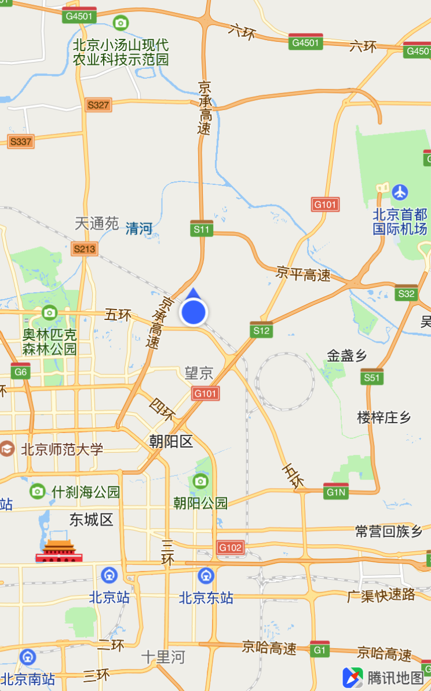
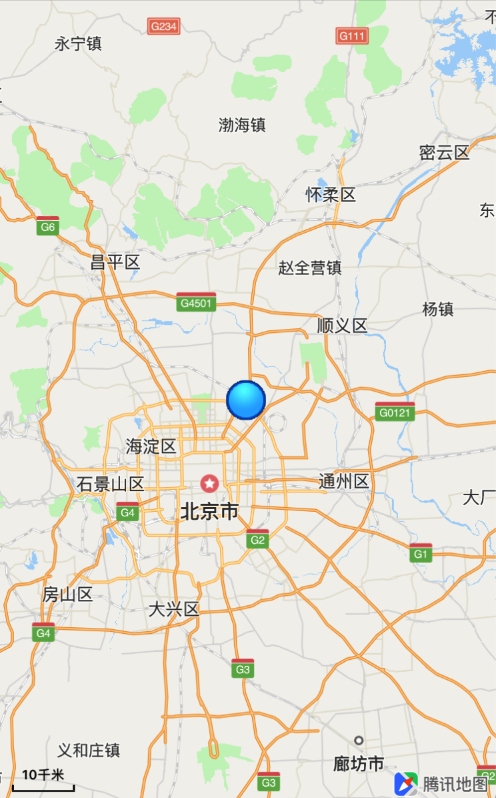

## 基本定位功能

###使用准备

腾讯地图SDK（iOS）封装了系统定位，方便用户使用，在使用定位功能前，需要向info.plist文件中添加定位权限：(以下二选一，两个都添加默认使用NSLocationWhenInUseUsageDescription）：

NSLocationWhenInUseUsageDescription：允许在前台使用时获取GPS的描述
NSLocationAlwaysUsageDescription：允许永久使用GPS的描述

###开启定位
<hr>
在创建mapView之后，可以通过`setShowsUserLocation:`方法来打开定位功能：

```objC
self.mapView.delegate = self;

// 开启定位
[self.mapView setShowsUserLocation:YES];
```

效果示例图如下：



<br>

###定位模式
<hr>
定位一共有地图跟踪三种模式，可以通过mapView的`setUserTrackingMode:(QUserTrackingMode)mode`方法来设置，支持的模式如下：

| 模式 | 说明
| --- | ---
| QUserTrackingModeNone |  不追踪用户的location更新
| QUserTrackingModeFollow | 追踪用户的location更新
| QUserTrackingModeFollowWithHeading | 追踪用户的location与heading更新

**注意：如果在QUserTrackingModeFollow和QUserTrackingModeFollowWithHeading模式下改变地图视野时，跟踪模式会转变为QUserTrackingModeNone，如果需要跟踪功能，则需要再次设置。**

<br>

###定位代理方法
<hr>
开启定位功能之后，实现`<QMapViewDelegate>`协议中的方法来监听定位的回调，当定位成功时将获取到 QUserLocation 对象，该对象包含的属性如下表所示：

| 属性 | 说明
| --- | ---
| CLLocation *location | 定位的位置信息
| CLHeading *heading | 指向信息

代理方法示例如下：

```objC
// <QMapViewDelegate>中的定位回调函数
- (void)mapViewWillStartLocatingUser:(QMapView *)mapView
{
    NSLog(@"%s", __FUNCTION__);
}

- (void)mapViewDidStopLocatingUser:(QMapView *)mapView
{
    NSLog(@"%s", __FUNCTION__);
}

/**
 * @brief 用户位置更新后，会调用此函数
 * @param mapView 地图View
 * @param userLocation 新的用户位置
 * @param fromHeading 是否为heading 变化触发，如果为location变化触发,则为NO
 */
- (void)mapView:(QMapView *)mapView didUpdateUserLocation:(QUserLocation *)userLocation fromHeading:(BOOL)fromHeading
{
    NSLog(@"%s fromHeading = %d, location = %@, heading = %@", __FUNCTION__, fromHeading, userLocation.location, userLocation.heading);
}

/**
 * @brief  定位失败后，会调用此函数
 * @param mapView 地图View
 * @param error 错误号，参考CLError.h中定义的错误号
 */
- (void)mapView:(QMapView *)mapView didFailToLocateUserWithError:(NSError *)error
{
    NSLog(@"%s error = %@", __FUNCTION__, error);
}

/**
 * @brief 定位时的userTrackingMode 改变时delegate调用此函数
 * @param mapView 地图View
 * @param mode QMUserTrackingMode
 * @param animated 是否有动画
 */
- (void)mapView:(QMapView *)mapView didChangeUserTrackingMode:(QUserTrackingMode)mode animated:(BOOL)animated
{
    NSLog(@"%s mode = %d, animated = %d", __FUNCTION__, mode, animated);
}
```

<br>

###自定义定位蓝点样式
<hr>
iOS地图SDK的定位功能除了默认样式的定位蓝点图标外，还支持通过 QUserLocationPresentation 来自定义样式的定位图标和定位圈的填充颜色。

QUserLocationPresentation 属性说明：

| 属性 | 说明
| --- | ---
| UIImage *icon | 定位图标
| UIColor *circleFillColor | 定位圈的填充色

自定义蓝点样式示例代码如下：

```objC
// 创建定位样式对象
QUserLocationPresentation *presentation = [[QUserLocationPresentation alloc] init];
    
// 定位图标
presentation.icon = [UIImage imageNamed:@"test_location_1"];
// 精度圈颜色
presentation.circleFillColor = [[UIColor grayColor] colorWithAlphaComponent:0.3];
    
// 配置定位样式
[self.mapView configureUserLocationPresentation:presentation];
```

示例图如下：

