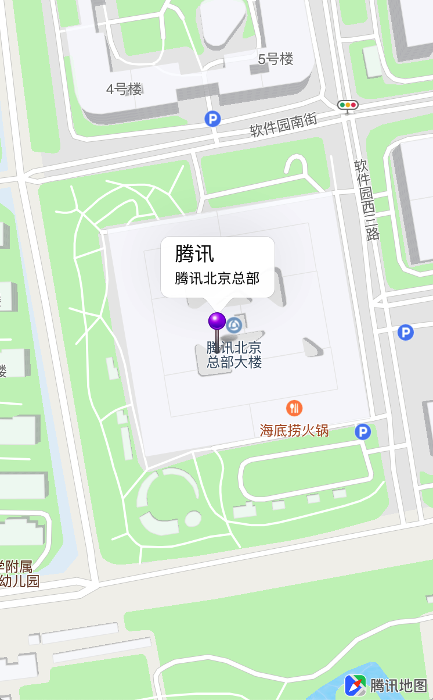
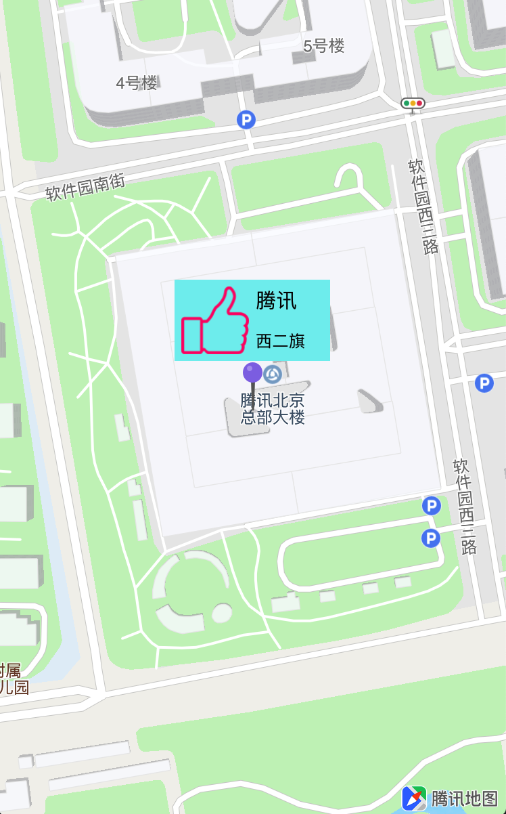

##点标记

点标记，即Annotation，用于在地图中标记位置，如POI位置、车辆位置等带有位置属性的事物。

腾讯地图SDK点标记功能分为两个部分，点标记数据对象(Annotation)和点标记的信息窗(CalloutView)。

Annotation和CalloutView提供了默认样式，同时也可以自定义样式。

<br>

###添加默认样式点标记
<hr>
SDK提供了默认的点标记数据对象(QPointAnnotation)和默认的大头针样式点标注View(QPinAnnotationView)，基本使用步骤如下：

1. 创建点标记数据对象，QPointAnnotation提供了点标记的位置、标题等信息：

	```objC
	QPointAnnotation *pointAnnotation = [[QPointAnnotation alloc] init];
	pointAnnotation.coordinate = CLLocationCoordinate2DMake(40.040219, 116.273348);
	// 点标注的标题
	pointAnnotation.title = @"腾讯";
	// 副标题
	pointAnnotation.subtitle = @"腾讯北京总部";
	
	// 将点标记添加到地图中
	[self.mapView addAnnotation:pointAnnotation];
	```
2. 实现&lt;QMapViewDelegate&gt;协议的`mapView:viewForAnnotation:`方法，创建点标注：

	```objC
	- (QAnnotationView *)mapView:(QMapView *)mapView viewForAnnotation:(id<QAnnotation>)annotation {
	    if ([annotation isKindOfClass:[QPointAnnotation class]]) {
	        static NSString *annotationIdentifier = @"pointAnnotation";
	        QPinAnnotationView *pinView = (QPinAnnotationView *)[self.mapView dequeueReusableAnnotationViewWithIdentifier:annotationIdentifier];
	        if (pinView == nil) {
	            pinView = [[QPinAnnotationView alloc] initWithAnnotation:annotation reuseIdentifier:annotationIdentifier];
	            pinView.canShowCallout = YES;
	        }
	        
	        return pinView;
	    }
	    
	    return nil;
	}
	```

3. 效果如下图所示：

	
	
<br>

###自定义样式点标记
<hr>
腾讯地图SDK可以自定义点标记样式，包括自定义点标记和自定义点标记信息窗口：

#### 1. 自定义点标记图标
如果默认的点标记样式无法满足需求，可以在创建QPinAnnotationView时自定义点标记图标：

```objC
// 修改点标记图标
pinView.image = [UIImage imageNamed:@"greenPin"];
```
	
效果如图所示：
	


#### 2. 自定义信息窗口
通过自定义信息窗口，可以展示更多标记点的信息，步骤如下：

自定义信息窗口类，示例代码如下：
	
```objC
#import <UIKit/UIKit.h>
	
@interface CustomCalloutView : UIView
// 图标
@property (nonatomic, strong) UIImage *image;
// 标题
@property (nonatomic, strong) NSString *title;
// 地址
@property (nonatomic, strong) NSString *address;
@end
	
	
#import "CustomCalloutView.h"
	
@interface CustomCalloutView ()
@property (nonatomic, strong) UILabel *titleLabel;
@property (nonatomic, strong) UILabel *addressLabel;
@property (nonatomic, strong) UIImageView *coverImageView;
@end
	
@implementation CustomCalloutView
	
- (instancetype)initWithFrame:(CGRect)frame {
    if (self = [super initWithFrame:frame]) {
        self.backgroundColor = [UIColor colorWithRed:124/255.0 green:238/255.0 blue:240/255.0 alpha:1];
        [self initSubviews];
    }
    return self;
}
	
- (void)initSubviews {
    CGFloat margin = 5;
    
    // 图标控件
    self.coverImageView = [[UIImageView alloc] initWithFrame:CGRectMake(margin, margin, 50, 50)];
    [self addSubview:self.coverImageView];
    
    // 标题控件
    self.titleLabel = [[UILabel alloc] initWithFrame:CGRectMake(margin * 2 + 50, margin, 50, 20)];
    self.titleLabel.font = [UIFont systemFontOfSize:15];
    self.titleLabel.textColor = [UIColor blackColor];
    [self addSubview:self.titleLabel];
    
    // 地址控件
    self.addressLabel = [[UILabel alloc] initWithFrame:CGRectMake(margin * 2 + 50, 35, 50, 20)];
    self.addressLabel.font = [UIFont systemFontOfSize:12];
    self.addressLabel.textColor = [UIColor blackColor];
    [self addSubview:self.addressLabel];
}
	
- (void)setTitle:(NSString *)title {
    _title = title;
    self.titleLabel.text = title;
}
	
- (void)setAddress:(NSString *)address {
    _address = address;
    self.addressLabel.text = address;
}
	
- (void)setImage:(UIImage *)image {
    _image = image;
    self.coverImageView.image = image;
}
	
@end
```

在创建Annotation时，指定customCalloutView属性，示例代码如下：

```objC
- (QAnnotationView *)mapView:(QMapView *)mapView viewForAnnotation:(id<QAnnotation>)annotation
{
    if ([annotation isKindOfClass:[QPointAnnotation class]])
    {
        static NSString *pointReuseIndetifier = @"pointReuseIndetifier";
        
        QPinAnnotationView *annotationView = (QPinAnnotationView *)[self.mapView dequeueReusableAnnotationViewWithIdentifier:pointReuseIndetifier];
        
        // 取出自定义信息窗口控件
        CustomCalloutView *customCalloutView = (CustomCalloutView *)annotationView.customCalloutView;
        
        if (annotationView == nil)
        {
            annotationView = [[QPinAnnotationView alloc] initWithAnnotation:annotation reuseIdentifier:pointReuseIndetifier];
            annotationView.canShowCallout = YES;
            
            // 如果annotationView为新创建，同时创建customCalloutView并赋值
            customCalloutView = [[CustomCalloutView alloc] initWithFrame:CGRectMake(0, 0, 15 + 100, 10 + 50)];
            annotationView.customCalloutView = customCalloutView;
        }
        
        customCalloutView.image = [UIImage imageNamed:@"good"];
        customCalloutView.title = annotation.title;
        customCalloutView.address = annotation.subtitle;
            
        return annotationView;
    }
    
    return nil;
}
```

#### 3. 效果如图所示：
	

		
<br>

###点标记的删除和批量操作
<hr>
单独添加一个点标记，已经在添加默认样式点标记中介绍了，本小结将介绍如何删除单个点标记、批量添加点标记和批量删除点标记。

+ 删除单个点标记：

	```objC
	[self.mapView removeAnnotation:annotation];
	```

+ 批量添加点标记：

	```objC
	[self.mapView addAnnotations:annotationArray];
	```	

+ 批量删除点标记

	```objC
	[self.mapView removeAnnotations:annotationArray];
	```

<br>

###点标记的动画效果和拖拽效果
<hr>
点标记在添加到地图中时，可以添加动画效果，点标记会添加掉落动画：

```objC
annotationView.draggable = YES;
```

通过对点标记进行长按手势，可以将点标记拖动到其他的位置：

```objC
annotationView.animatesDrop = YES;
```
        
<br>

###点标记的事件监听
<hr>
点标记默认可以响应点击事件并切换到选中状态，事件响应可以控制开启、关闭。实现&lt;QMapViewDelegate&gt;中的代理方法，可以监听点标记的事件。

+ 点标记的事件响应开关：

	```objC
	// 默认为YES, 当为NO时view忽略触摸事件
	annotationView.enable = NO;
	
	// 获取当前点标记是否处于选中状态
	if (annotationView.selected) {
		...
	}
	```
	
+ 点标注的监听方法

	```objC
	// 当mapView新添加annotation views时，调用此接口
	- (void)mapView:(QMapView *)mapView didAddAnnotationViews:(NSArray<QAnnotationView *> *)views;
	
	// 当选中一个annotation view时，调用此接口
	- (void)mapView:(QMapView *)mapView didSelectAnnotationView:(QAnnotationView *)view;
	
	// 当取消选中一个annotation view时，调用此接口
	- (void)mapView:(QMapView *)mapView didDeselectAnnotationView:(QAnnotationView *)view;
	
	// 拖动annotationView时view的状态变化
	- (void)mapView:(QMapView *)mapView annotationView:(QAnnotationView *)view didChangeDragState:(QAnnotationViewDragState)newState
	   fromOldState:(QAnnotationViewDragState)oldState;
	```
	
+ 点标注的拖动状态：QAnnotationViewDragState

| 状态 | 说明
| --- | ---
| QAnnotationViewDragStateNone | 静止状态
| QAnnotationViewDragStateStarting | 开始拖动
| QAnnotationViewDragStateDragging | 拖动中
| QAnnotationViewDragStateCanceling | 取消拖动
| QAnnotationViewDragStateEnding | 拖动结束
	
<br>

###常用方法
<hr>
+ 调增地图显示范围，使其显示范围内的所有点标记：
	1. 获取构成Annotation、Polyline和多边形的的坐标
	2. 计算这些坐标构成的最小外接region
	3. 更新地图显示region

		```objC
		// 点标注坐标
		CLLocationCoordinate2D coordinates[4];
		coordinates[0] = CLLocationCoordinate2DMake(40.041554,116.271508);
		coordinates[1] = CLLocationCoordinate2DMake(40.041652,116.274619);
		coordinates[2] = CLLocationCoordinate2DMake(40.03863,116.271787);
		coordinates[3] = CLLocationCoordinate2DMake(40.038745,116.275134);
		    
		// 计算最小外接区域
		QCoordinateRegion region = QBoundingCoordinateRegionWithCoordinates(coordinates, 4);
		// 更新可见region
		[self.mapView setRegion:region edgePadding:UIEdgeInsetsZero animated:YES];
		```
	4. 效果如图所示：
	
		


###常见问题
<hr>
1. 多个点标记距离较近，出现相互覆盖的情况

	> AnnotationView提供了zIndex属性，该值默认为0，值大的会覆盖在值小的上面。

2. 如何添加海量点标记

	> Marker是绘制在地图之上的图片资源，当使用海量的Marker数据时，为了性能体验，建议使用[点聚合]()来辅助显示

