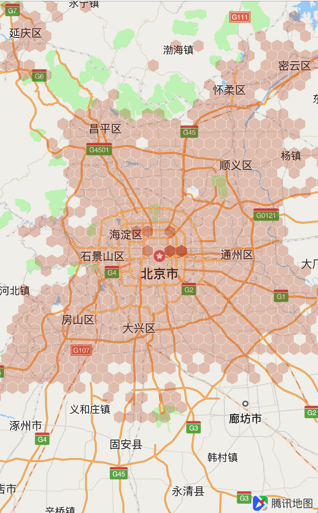
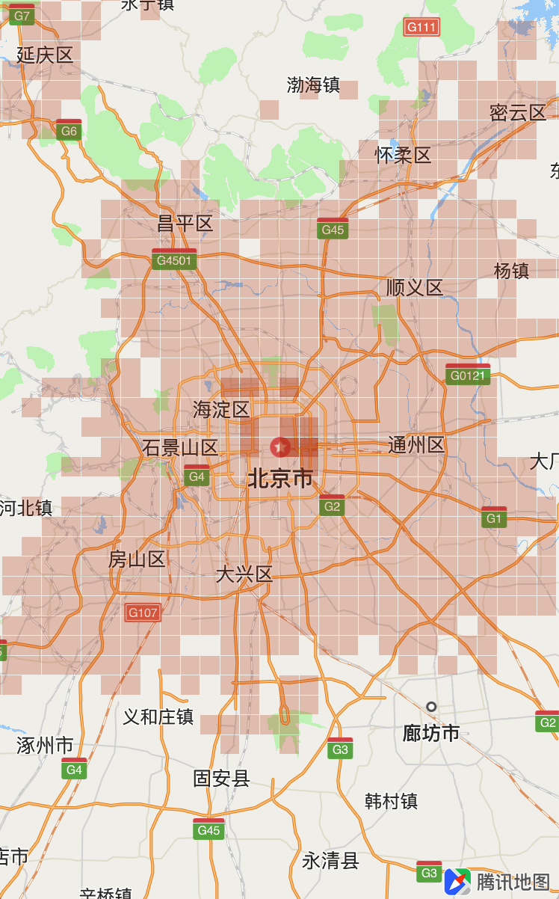
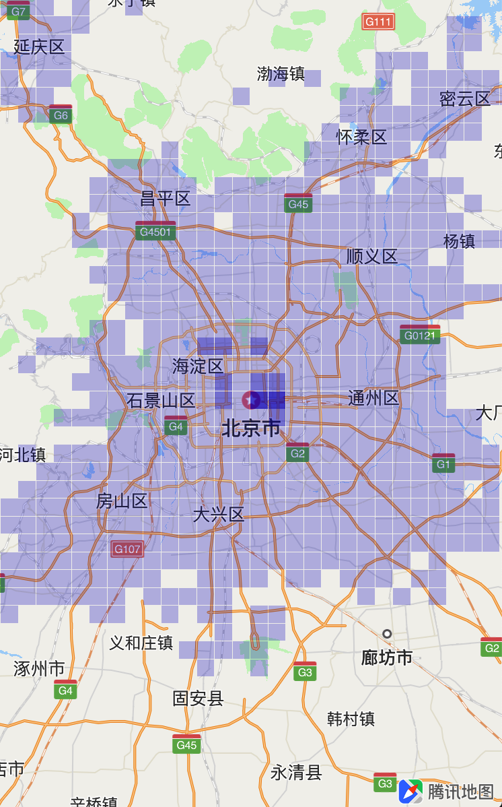

# 蜂窝热力图

<hr>

腾讯地图SDK自4.3.4版本起，将支持蜂窝热力图功能，该功能可以让热力图以蜂窝形状或正方形状绘制，并支持点击区域显示详细信息功能，示例图如下：




<br>

蜂窝热力图使用步骤与热力图类似，下面我们将分三部分，帮助开发者熟悉热力图的配置：

1. 添加指定样式的蜂窝热力图
2. 配置蜂窝热力图的参数
3. 点击热力图返回区域信息
4. 移除热力图

<br>

## 添加指定样式的蜂窝热力图

为了添加一个简单的热力图，你需要提前准备好带有坐标分布的数据集。基本使用步骤如下：

1. 准备热力节点需要的坐标分布数据，示例如下：

	```objc
	// 纬度 经度 权值
	116.895579	24.306521	43
	```

2. 遍历所有数据创建QHeatNode热力节点对象，保存在数组中：

	```objc
	NSMutableArray <QHeatNode *> *nodes = [NSMutableArray array];
	{
		// 读取本地包含热力节点数据的文件
	    NSString *filePath = [[NSBundle mainBundle] pathForResource:@"vectorHeat" ofType:@"json"];
	    
	    NSData *data = [NSData dataWithContentsOfFile:filePath];
	    
	    NSError *err = [[NSError alloc] init];
	    NSDictionary *dict = [NSJSONSerialization JSONObjectWithData:data options:kNilOptions error:&err];
	    
	    NSArray *array = [dict objectForKey:@"data"];
	    
	    
	    for (NSDictionary *dict in array) {
	        
	        double ul_lat = [[dict valueForKey:@"ul_lat"] doubleValue];
	        double ul_lng = [[dict valueForKey:@"ul_lng"] doubleValue];
	        double lr_lat = [[dict valueForKey:@"lr_lat"] doubleValue];
	        double lr_lng = [[dict valueForKey:@"lr_lng"] doubleValue];
	        
	        // 经纬度
	        double lat = (ul_lat / 100 + lr_lat / 100) / 2;
	        double lon = (ul_lng / 100 + lr_lng / 100) / 2;
	        
	        // 权值
	        double val = [[dict valueForKey:@"count"] doubleValue];
	 
	 		// 创建热力节点
	        QHeatNode *node = [[QHeatNode alloc] init];
	        node.coordinate = CLLocationCoordinate2DMake(lat, lon);
	        node.value      = val;
	        
	        [nodes addObject:node];
	    }
	}
	```
3. 创建热力图属性对象QVectorHeatOverlayOption，指定蜂窝热力图的属性：

	```objc
	QVectorHeatOverlayOption *option = [[QVectorHeatOverlayOption alloc] init];
	// 显示时边框单元的宽度
	option.size = 3000 * 1;
	// 显示时边框之间的间隔
	option.gap = 100;
	// 热力图的类型
	option.type = QVectorHeatTypeHoneyComb;
	```
4. 通过节点对象数组和热力图属性对象，创建QVectorHeatOverlay并添加到mapView中：

	```objc
	QVectorHeatOverlay *heat = [[QVectorHeatOverlay alloc] initWithHeatNodes:nodes option:option];
	
	[self.mapView addOverlay:self.heatTileOverlay];
	```
5. 效果如下图所示：

	
	
<br>

## 配置蜂窝热力图的参数

QVectorHeatOverlayOption对象用于配置热力图的属性，常用属性如下表所示：

| 属性 | 说明
| --- | ---
| QVectorHeatType type | QVectorHeatTypeHoneyComb：蜂窝形<br>QVectorHeatTypeSquare：正方形
| CLLocationDistance size | 显示时边框单元的宽度（内切圆的直径） 单位：米
| CLLocationDistance gap | 显示时边框之间的间隔 单位：米
| CGFloat opacity | 透明度，取值范围[0,1]，默认为1不透明
| CGFloat minZoom | 最小显示级别，默认3
| CGFloat maxZoom | 最大显示级别，默认20
| NSArray\<UIColor \*\> \*colors | 颜色变化数组，与startPoints配合使用。<br>注意：colors和startPoints两数组长度必须一致且不能为0
| NSArray<NSNumber *> *startPoints | 颜色变化起点，需为递增数组，每个元素代表权重的一个节点(此节点为显示颜色的切换点)

#### 配置热力图颜色方式如下所示：

```objc
option.startPoints = @[@0.0, @0.6, @0.8];
option.colors = @[[UIColor colorWithRed:0 green:0 blue:1 alpha:0.3],
                  [UIColor colorWithRed:0 green:0 blue:1 alpha:0.6],
                  [UIColor colorWithRed:0 green:0 blue:1 alpha:0.9]];
```



<br>

## 点击热力图返回区域信息

QVectorHeatAggregationUnit表示一个热力图展示单元，其基本属性如下表所示：

| 属性 | 说明
| --- | ---
| CLLocationCoordinate2D center | 中心点坐标
| float intensity | 当前热力值，求和后的权重
| NSArray<NSNumber \*> \*nodeIndices | 落在此单元区域内的所有热力点的索引数组

QVectorHeatOverlay提供的 `getAggregationUnit:` 方法可以根据传入的坐标参数来获取该坐标点的热力图单元对象，如果该坐标点没有热力单元对象，则返回nil。搭配mapView的点击方法 `mapView: didTapAtCoordinate:` 可以获得点击点的热力单元：

```objc
- (void)mapView:(QMapView *)mapView didTapAtCoordinate:(CLLocationCoordinate2D)coordinate
{
    QVectorHeatAggregationUnit *unit = [self.heatTileOverlay getAggregationUnit:coordinate];
    if (unit)
    {
        NSLog(@"count=%ld. intensity=%f. || center=(%f,%f). point=(%f,%f)", unit.nodeIndices.count, unit.intensity, unit.center.latitude, unit.center.longitude, QMapPointForCoordinate(unit.center).x, QMapPointForCoordinate(unit.center).y);
    }
}
```

<br>

## 移除热力图

调用mapView的`removeOverlay:`即可将热力图移除：

```objc
[self.mapView removeOverlay:self.heatTileOverlay];
```
