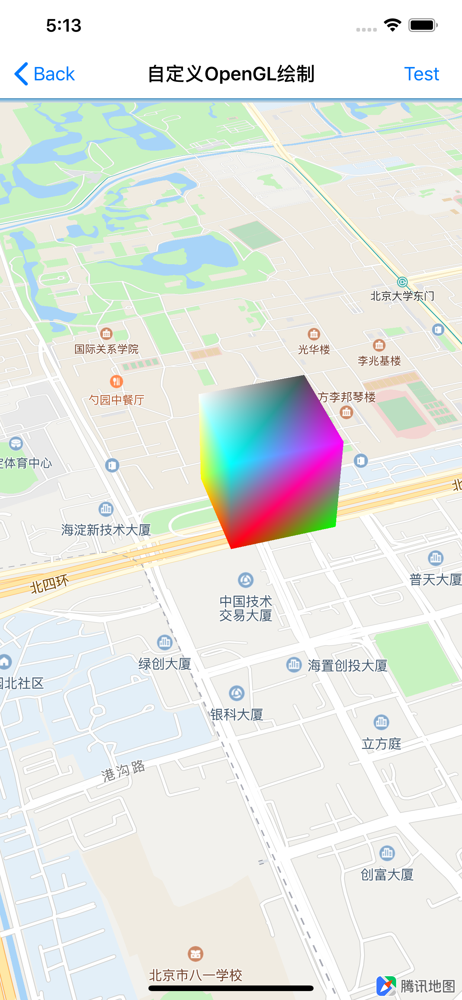

# OpenGL绘制

<hr>

腾讯地图SDK自v4.3.4起，将支持使用OpenGLES 2.0进行3D模型绘制，为开发者在地图上提供更灵活的样式绘制，加强显示效果，提升用户体验。


目前支持opengl相关接口有：

1. 获取地图投影坐标矩阵：`[mapview glProjectionMatrix]`
2. 获取地图视图坐标矩阵：`[mapview glViewMatrix]`
3. 从经纬度转换成对应的地图坐标：`[mapview glVertexForCoordinate:coordinate]`
5. 获取地图单位Point缩放比率：`[mapview glPointRatio]`
6. 实现自定义渲染回调：`- (void)mapViewDrawFrame:(QMapView *)mapView`

我们将通过下面的示例代码，来说明以上接口如何进行使用

<br>

## 绘制3D立方体

1. 声明顶点相关数据

	```objc
	// 顶点坐标
	float _vertext[totalVertexCount * 3];
	// 索引
	short _indecies[indexCount];
	// 每个顶点的颜色
	float _color[totalVertexCount * 4];
	// 立方体的缩放因
	float _scale[16];
	
	```

2. 初始化数据

	```objc-c
	- (void)initVertext
	{
	  	// 初始化每个顶点坐标。本例中基于像素单位
		  _vertext[i] = vertext[i] * kEdgeLength;
			// ...
	  	// 索引
	  	_indecies[i] = indices[i];
			// ...
	  	// 每个顶点的颜色
	  	_color[i] = colors[i];
			// ...
	  	// 立方体的缩放因子
	  	_scale[i] = scale[i];
	    // ...
	}

	- (void)initShader
	{
	    // ...
	}
	```

3. 创建drawCube方法绘制立方体

	```objc
	// 绘制固定像素大小的立方体
	- (void)drawCube
	{
	    // 0. 准备opengl渲染环境
	
	    // 1.  传入opengl立方体的顶点坐标和和各自的颜色值
	
	    glEnableVertexAttribArray(_vertexLocation);
	    glVertexAttribPointer(_vertexLocation, 3, GL_FLOAT, false, 0, _vertext);
	
	    glEnableVertexAttribArray(_colorLocation);
	    glVertexAttribPointer(_colorLocation, 4, GL_FLOAT, false, 0, _color);
	
	    // 2. 为了固定像素大小绘制立方体，需要将绽放因子_scale乘以glPointRatio比例值
	  
	    // 显示屏幕point宽度时需要乘以此scale
	    float scalePerPoint = [self.mapView glPointRatio];
	      // 当前级别下的像素宽
	    GLKMatrix4 sm = GLKMatrix4MakeScale(scalePerPoint, scalePerPoint, scalePerPoint);
	    for (int i = 0; i < 16; i++)
	    {
	        viewMatrix[i] = vm.m[i];
	        projectionMatrix[i] = pm.m[i];
	        // 当前级别下的像素宽
	        _scale[i] = sm.m[i];
	    }
	
	    // 3.　应用地图的矩阵glViewMatrix和glProjectionMatrix
	
	    // 当前地图view矩阵
	    float * map_viewMatrix = [self.mapView glViewMatrix];
	    // 当前地图projection矩阵
	    float * map_projectionMatrix = [self.mapView glProjectionMatrix];
	    float viewMatrix[16], projectionMatrix[16];
	    GLKMatrix4 pm = GLKMatrix4MakeWithArray(map_projectionMatrix);
	    GLKMatrix4 vm = GLKMatrix4MakeWithArray(map_viewMatrix);
	
	    glUniformMatrix4fv(_scaleMatrixLocation, 1, false, _scale);
	    glUniformMatrix4fv(_viewMatrixLocation, 1, false, viewMatrix);
	    glUniformMatrix4fv(_projectionMatrixLocation, 1, false, projectionMatrix);
	  
	    // 4. 调用opengl的渲染接口，绘制固定像素大小的立方体
	    glDrawElements(GL_TRIANGLES, 36, GL_UNSIGNED_SHORT, _indecies);
	  
	    
	    // 说明：	
	    // 本例中为固定像素大小的立方体。如果需要地理尺寸的绘制内容，需要将其每个经纬度点转换为对应的opengl坐标.
	    // 此时不再需要使用glPointRatio
	    // 样例如下：
	    //  for (int i = 0; i < count; i++) {
	    //      CLLocationCoordinate2D coord = coordinates[i];
	    //      CGPoint vt = [self.mapView glVertexForCoordinate:coord];
	    //      _vertext[i] = vt;
	    //  }
	  	  
	}
	```

4. 实现自定义渲染回调

	```objc
	// 地图渲染每一帧过程中都会调用此接口
	- (void)mapViewDrawFrame:(QMapView *)mapView
	{
	    [self drawCube];
	}
	```

<br>

## 效果图


